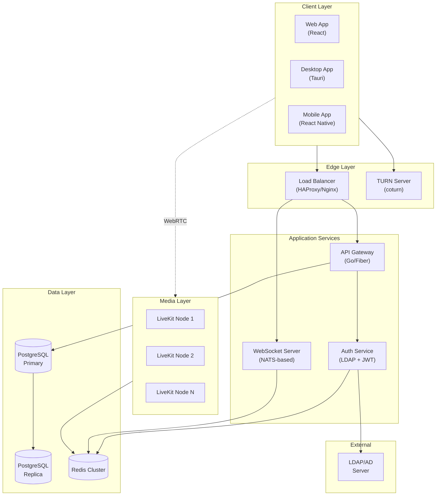
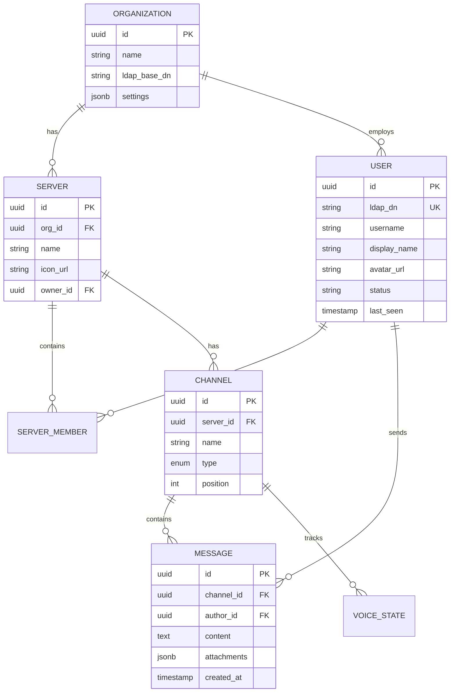
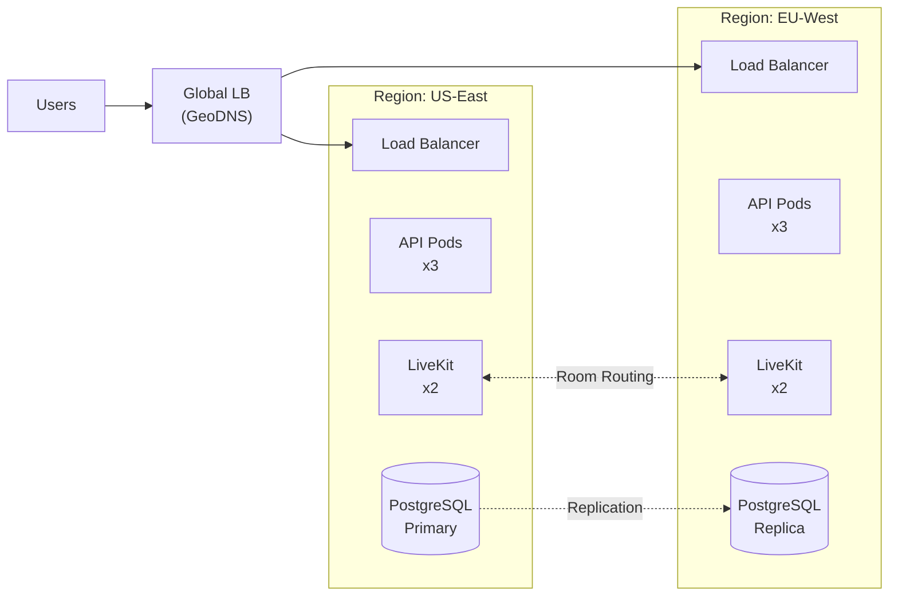

# EchoRift - Enterprise Discord Clone

A self-hosted, scalable Discord alternative with LDAP authentication for enterprise and business teams.

---

## Executive Summary

EchoRift is designed to be a high-performance, enterprise-grade communication platform with:
- **LDAP/Active Directory** authentication for seamless SSO
- **Ultra-low latency** voice, video, and screen sharing
- **Self-hosted** deployment on your own infrastructure
- **Adaptive quality** for users with poor connectivity

---

## Technology Stack

| Layer | Technology | Rationale |
|-------|------------|-----------|
| **Media Server** | LiveKit | SFU architecture, simulcast, Opus/VP8/H.264, adaptive bitrate, ~0.2s latency |
| **Backend API** | Go (Fiber) | Low memory footprint, excellent concurrency, fast compilation |
| **Real-time Messaging** | NATS | Lightweight, clusterable pub/sub for WebSocket fan-out |
| **Database** | PostgreSQL | ACID compliance, JSONB for flexible data, proven scalability |
| **Cache/Sessions** | Redis | Sub-ms latency, pub/sub for presence, session storage |
| **Auth** | go-ldap + JWT | Native LDAP v3 support, stateless JWT for API auth |
| **Frontend** | React + Vite | Fast dev experience, component ecosystem |
| **Desktop App** | Tauri (Rust) | 10x smaller than Electron, native performance |
| **Container Runtime** | Docker + K8s | Industry standard, horizontal scaling |

---

## Architecture Overview



---

## Low-Bandwidth Optimization Strategy

### 1. Simulcast (Multi-Layer Streaming)
```
┌─────────────────────────────────────────────────┐
│ Sender publishes 3 quality layers:              │
│   ▪ High:   720p @ 1.5 Mbps                     │
│   ▪ Medium: 360p @ 500 kbps                     │
│   ▪ Low:    180p @ 150 kbps                     │
│                                                 │
│ LiveKit SFU selects best layer per receiver    │
└─────────────────────────────────────────────────┘
```

### 2. Adaptive Bitrate with Congestion Control
- **Transport-Wide Congestion Control (TWCC)**: Real-time bandwidth estimation
- **Google Congestion Control (GCC)**: Proactive bitrate adjustment
- **Receiver Estimated Maximum Bitrate (REMB)**: Per-client quality adaptation

### 3. Opus Audio Codec Configuration
```yaml
codec: opus
sample_rate: 48000
channels: 2
bitrate: 32000  # 32 kbps (Discord uses 64-96 kbps)
fec: true       # Forward Error Correction
dtx: true       # Discontinuous transmission (saves bandwidth during silence)
```

### 4. Video Codec Selection
| Codec | Use Case | Bandwidth | CPU Impact |
|-------|----------|-----------|------------|
| VP8 | Camera video | Medium | Low |
| VP9 | Screen sharing | Low | Medium |
| H.264 | Hardware encoding | Lowest | Lowest |
| AV1 | Future default | Lowest | High |

---

## Project Structure

```
EchoRift/
├── apps/
│   ├── web/                 # React web client
│   ├── desktop/             # Tauri desktop app
│   └── mobile/              # React Native (future)
├── services/
│   ├── api/                 # Go API server
│   ├── auth/                # LDAP + JWT auth service
│   ├── gateway/             # WebSocket gateway
│   └── media-orchestrator/  # LiveKit coordination
├── packages/
│   ├── ui/                  # Shared React components
│   ├── sdk/                 # Client SDK
│   └── proto/               # Protocol buffers
├── infrastructure/
│   ├── docker/              # Docker configs
│   ├── k8s/                 # Kubernetes manifests
│   └── terraform/           # IaC for cloud deployment
└── docs/                    # Documentation
```

---

## Database Schema



---

## Scalability Architecture



---

## Security Considerations

- All traffic encrypted (TLS 1.3)
- E2E encryption for DMs (optional feature)
- LDAP connection over LDAPS (port 636)
- JWT tokens with short expiry (15 min access, 7 day refresh)
- Rate limiting on all endpoints
- Audit logging for compliance

---

## Implementation Phases

### Phase 1: Foundation (Weeks 1-3)
- Project scaffolding and monorepo setup
- Database schema and migrations
- LDAP authentication service
- Basic API endpoints (users, organizations)

### Phase 2: Core Features (Weeks 4-6)
- Servers and channels CRUD
- Real-time messaging via WebSocket
- Frontend: Server/Channel navigation
- Message history and pagination

### Phase 3: Voice & Video (Weeks 7-9)
- LiveKit integration
- Voice channels with mute/deafen
- Video calls (1:1 and group)
- Screen sharing

### Phase 4: Polish & Scale (Weeks 10-12)
- Desktop app (Tauri)
- Push notifications
- Admin dashboard
- Kubernetes deployment
- Load testing and optimization
